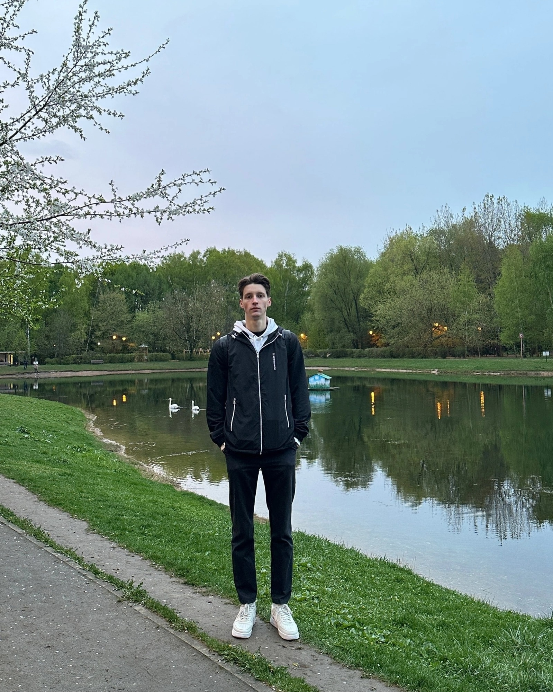

Привет! Меня зовут Оберган Фёдор. Я живу в Москве.  
Учусь на 5 курсе механико - математического факультета МГУ имени М. В. Ломоносова.  
Люблю математику и программирование.  
Увлекаюсь музыкой, кино и спортом. Некоторое время профессионально занимался футболом и плаванием.